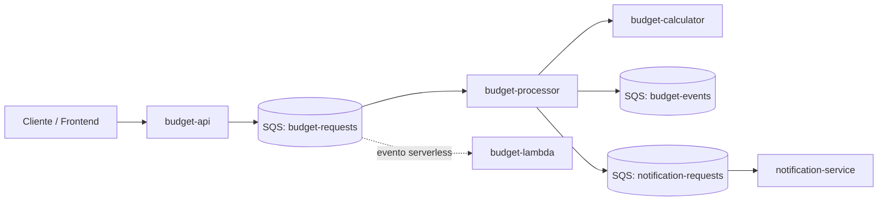
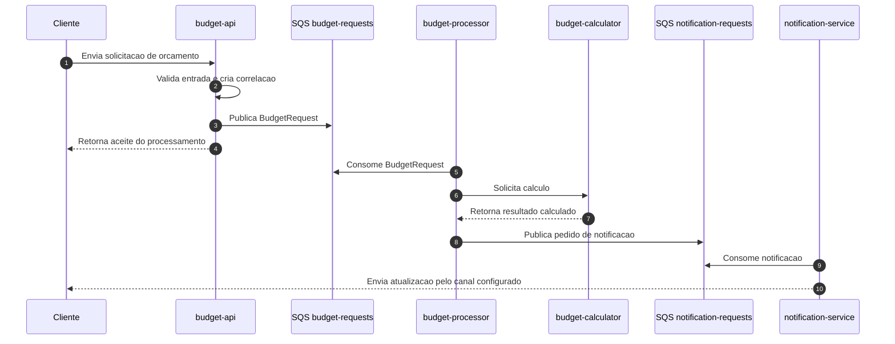
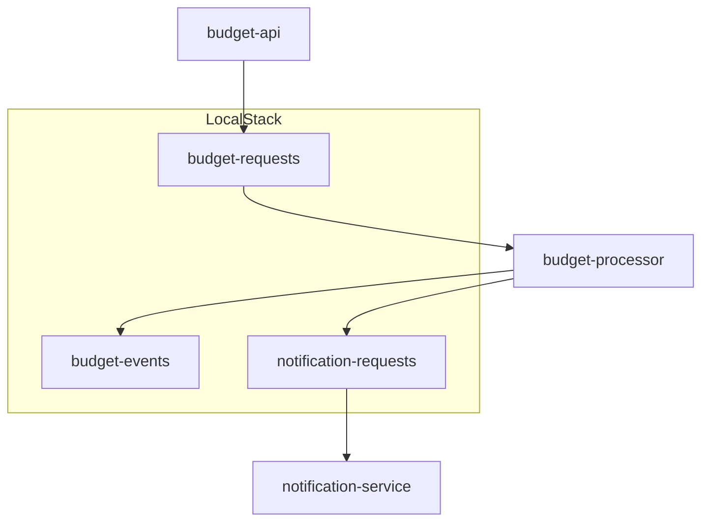
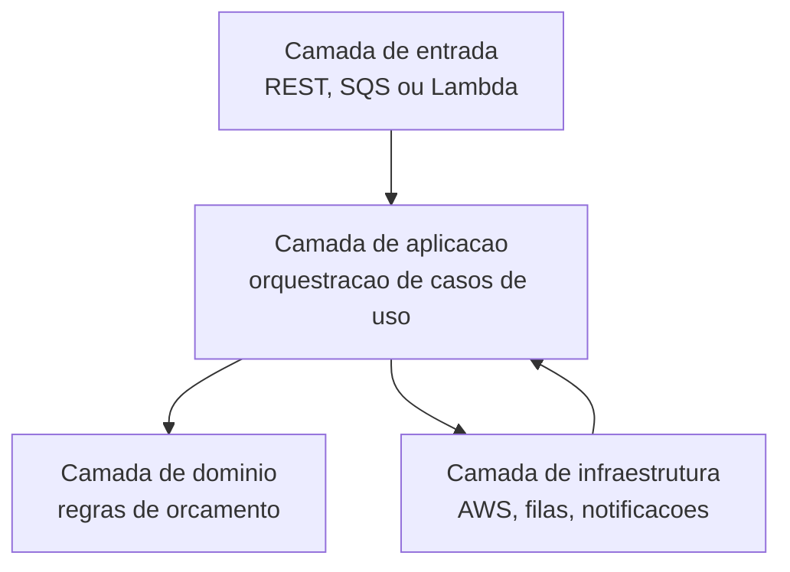

# Orcamento Microservice

Base inicial para o projeto de orcamentos usando Spring Boot, AWS Lambda, Amazon SQS e LocalStack.

O objetivo do projeto e separar o fluxo de solicitacao, processamento, calculo e notificacao de orcamentos em modulos pequenos, com comunicacao assincrona entre as etapas que nao precisam responder imediatamente ao usuario.

## Visao geral



## Modulos

### `budget-api`

API REST responsavel por receber solicitacoes de orcamento e iniciar o fluxo.

Responsabilidades previstas:

- Expor endpoints HTTP para cadastro, consulta e acompanhamento de solicitacoes de orcamento.
- Validar payloads de entrada com Bean Validation antes de publicar mensagens.
- Gerar ou propagar identificadores de correlacao para rastrear a solicitacao entre os modulos.
- Publicar solicitacoes validas na fila `budget-requests`.
- Expor documentacao OpenAPI/Swagger para facilitar testes e integracoes.
- Disponibilizar endpoints operacionais via Actuator, inicialmente `health` e `info`.

Tecnologias principais:

- Spring Boot Web
- Spring Boot Validation
- Springdoc OpenAPI
- AWS SDK SQS
- Spring Boot Actuator

### `budget-processor`

Servico assincrono responsavel por consumir solicitacoes de orcamento e coordenar o processamento.

Responsabilidades previstas:

- Consumir mensagens da fila `budget-requests`.
- Converter a mensagem de entrada para o modelo interno de processamento.
- Acionar o `budget-calculator` para aplicar as regras de calculo.
- Controlar estados do processamento, como recebido, em calculo, calculado, falha e aguardando notificacao.
- Publicar eventos de dominio na fila `budget-events` quando houver mudancas relevantes no orcamento.
- Publicar pedidos de notificacao na fila `notification-requests`.
- Tratar falhas transitorias com estrategia de retry e preparar o fluxo para DLQ quando a infraestrutura for evoluida.

Tecnologias principais:

- Spring Boot
- AWS SDK SQS
- Spring Boot Actuator

### `budget-calculator`

Servico de dominio dedicado as regras de calculo de orcamento.

Responsabilidades previstas:

- Centralizar regras de precificacao, descontos, taxas, adicionais e totais.
- Manter a logica de calculo isolada dos detalhes de transporte HTTP, SQS ou Lambda.
- Expor uma interface de calculo que possa ser usada pelo processador e, se necessario, por chamadas REST.
- Validar consistencia dos itens do orcamento antes de calcular totais.
- Facilitar testes unitarios das regras de negocio sem depender da infraestrutura AWS.

Tecnologias principais:

- Spring Boot Web
- Spring Boot Actuator
- JUnit/Spring Boot Test

### `notification-service`

Servico responsavel por notificacoes relacionadas ao ciclo de vida do orcamento.

Responsabilidades previstas:

- Consumir mensagens da fila `notification-requests`.
- Montar mensagens de notificacao com base no status e no resultado do orcamento.
- Encapsular integracoes futuras com e-mail, SMS, WhatsApp, webhooks ou outro canal.
- Evitar que falhas de notificacao bloqueiem o calculo do orcamento.
- Registrar tentativas, falhas e resultados de envio para observabilidade.

Tecnologias principais:

- Spring Boot
- AWS SDK SQS
- Spring Boot Actuator

### `budget-lambda`

Modulo serverless para integracoes do fluxo de orcamento via AWS Lambda.

Responsabilidades previstas:

- Expor uma funcao Spring Cloud Function chamada `processBudgetRequest`.
- Permitir processamento acionado por eventos AWS, como SQS ou outros gatilhos serverless.
- Gerar um artefato empacotado com `maven-shade-plugin`, adequado para deploy em Lambda.
- Reaproveitar contratos e regras do fluxo principal quando o projeto evoluir para bibliotecas compartilhadas.

Tecnologias principais:

- Spring Cloud Function
- Spring Cloud Function AWS Adapter
- AWS Lambda Java Core
- AWS Lambda Java Events
- Maven Shade Plugin

## Fluxo de processamento



## Filas locais

O ambiente local usa LocalStack para simular servicos AWS. O script `localstack/init/01-sqs.sh` cria as filas:

- `budget-requests`: entrada principal das solicitacoes de orcamento.
- `budget-events`: eventos de dominio ou status emitidos durante o processamento.
- `notification-requests`: solicitacoes de notificacao geradas pelo fluxo.



## Estrutura do projeto

```text
.
|-- budget-api
|-- budget-processor
|-- budget-calculator
|-- notification-service
|-- budget-lambda
|-- localstack/init/01-sqs.sh
|-- docker-compose.yml
`-- pom.xml
```

## Requisitos

- Java 17
- Maven 3.9+
- Docker e Docker Compose para infraestrutura local

## Infra local

O `docker-compose.yml` sobe LocalStack com SQS, Lambda, IAM e Logs habilitados para desenvolvimento local.

```bash
docker compose up -d
```

Para conferir as filas criadas usando o LocalStack:

```bash
docker exec orcamento-localstack awslocal sqs list-queues
```

## Comandos

Executar todos os testes:

```bash
mvn clean test
```

Executar verificacao com relatorio JaCoCo:

```bash
mvn clean verify
```

Subir a API REST:

```bash
mvn -pl budget-api spring-boot:run
```

Empacotar a Lambda:

```bash
mvn -pl budget-lambda package
```

## Testando a API com SQS local

Suba a infraestrutura local:

```bash
docker compose up -d
```

Suba a API:

```bash
mvn -pl budget-api spring-boot:run
```

Acesse o Swagger:

```text
http://localhost:8081/swagger-ui.html
```

Execute `POST /budgets` com um payload valido:

```json
{
  "customerName": "Ricardo Alves",
  "description": "Orcamento para teste no Swagger",
  "amount": 1500.00
}
```

Se a criacao funcionar, a API retorna `202 Accepted` com status `RECEIVED` e publica uma mensagem na fila `budget-requests`.

Para ver a mensagem na fila sem instalar o AWS CLI localmente:

```bash
docker exec orcamento-localstack awslocal sqs receive-message --queue-url http://sqs.us-east-1.localhost.localstack.cloud:4566/000000000000/budget-requests
```

Se quiser ver a mesma mensagem mais de uma vez durante testes, use um visibility timeout curto:

```bash
docker exec orcamento-localstack awslocal sqs receive-message --queue-url http://sqs.us-east-1.localhost.localstack.cloud:4566/000000000000/budget-requests --visibility-timeout 5
```

Para listar as filas criadas no LocalStack:

```bash
docker exec orcamento-localstack awslocal sqs list-queues
```

## Portas e endpoints

- `budget-api`: `http://localhost:8081`
- Actuator da API: `http://localhost:8081/actuator/health`
- Swagger UI da API, quando houver controllers mapeados: `http://localhost:8081/swagger-ui.html`
- LocalStack: `http://localhost:4566`
- MongoDB local do projeto: `localhost:27018`

## Direcionamento de arquitetura



Principios para evolucao dos modulos:

- Manter regra de negocio fora de controllers, consumidores SQS e handlers Lambda.
- Tratar SQS como contrato de integracao entre modulos, com mensagens versionaveis.
- Preferir processamento assincrono para etapas demoradas ou sujeitas a falhas externas.
- Isolar integracoes externas em adapters para preservar testes de dominio simples.
- Usar logs com identificador de correlacao para acompanhar uma solicitacao de ponta a ponta.
