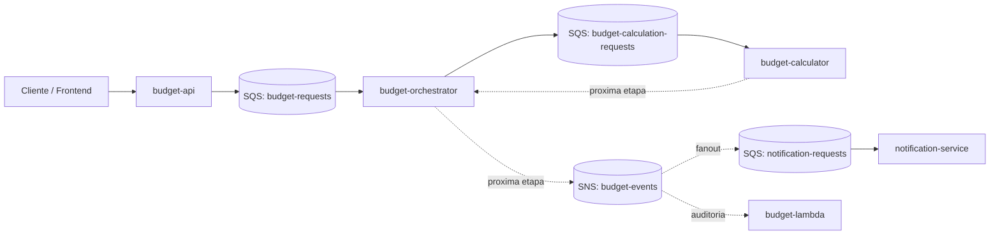
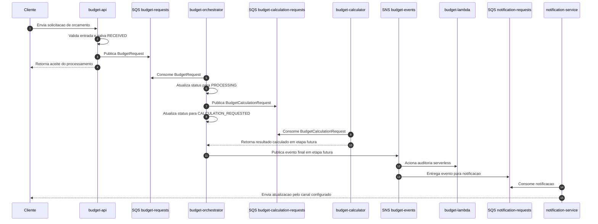
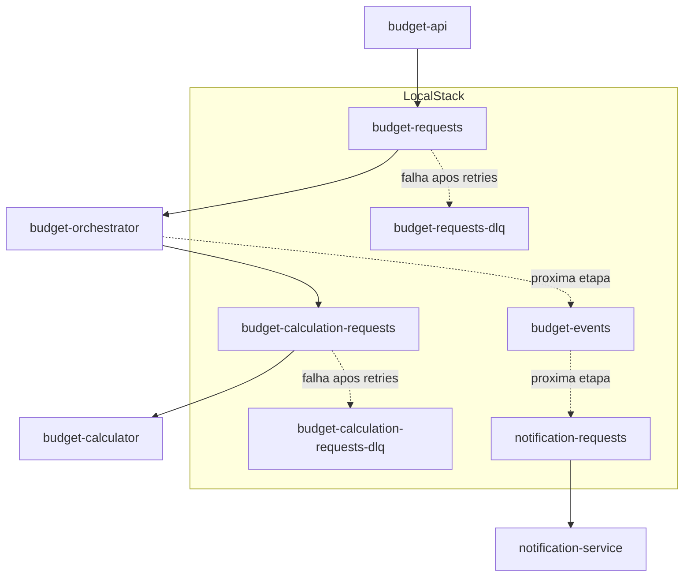
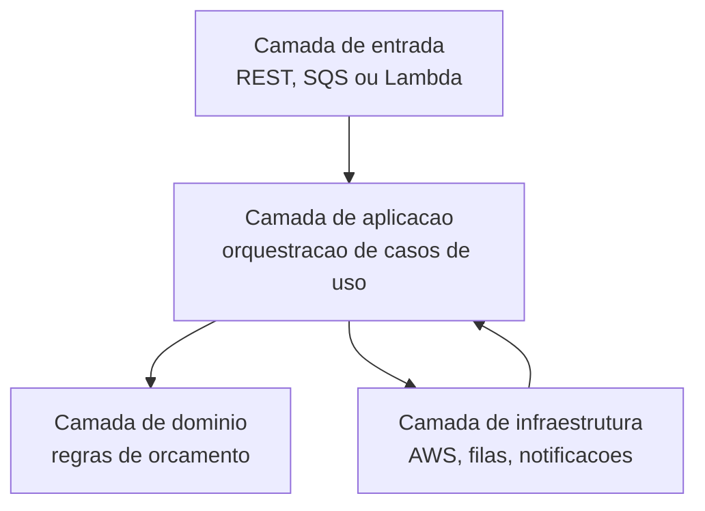

# Orcamento Microservice

Projeto de estudo e portfolio para um fluxo de orcamentos usando Spring Boot, MongoDB, Amazon SQS, AWS Lambda, SNS e LocalStack.

O objetivo do projeto e separar o fluxo de solicitacao, processamento, calculo e notificacao de orcamentos em modulos pequenos, com comunicacao assincrona entre as etapas que nao precisam responder imediatamente ao usuario.

Estado atual do projeto:

- `budget-api` recebe e consulta orcamentos via REST.
- `budget-api` salva o orcamento no MongoDB e publica uma mensagem na fila `budget-requests`.
- `budget-orchestrator` consome `budget-requests`, atualiza o status no MongoDB e publica uma mensagem para `budget-calculation-requests`.
- As filas principais possuem DLQ configurada no LocalStack.
- `budget-calculator`, `notification-service`, `budget-lambda` e SNS estao preparados como proximas etapas de evolucao.

## Visao geral



## Modulos

### `budget-api`

API REST responsavel por receber solicitacoes de orcamento e iniciar o fluxo.

Responsabilidades previstas:

- Expor endpoints HTTP para cadastro e consulta de solicitacoes de orcamento.
- Validar payloads de entrada com Bean Validation.
- Validar regra de negocio inicial para `amount`, garantindo valor preenchido e maior que zero.
- Persistir o orcamento no MongoDB com status inicial `RECEIVED`.
- Publicar solicitacoes validas na fila `budget-requests`.
- Marcar o orcamento como `PUBLISH_FAILED` quando nao conseguir publicar no SQS.
- Centralizar respostas de erro em um `GlobalExceptionHandler`.
- Expor documentacao OpenAPI/Swagger para facilitar testes.
- Disponibilizar endpoints operacionais via Actuator.

Tecnologias principais:

- Spring Boot Web
- Spring Boot Validation
- Spring Data MongoDB
- Springdoc OpenAPI
- AWS SDK SQS
- Spring Boot Actuator

### `budget-orchestrator`

Servico assincrono responsavel por orquestrar o ciclo de vida do orcamento.

Responsabilidades previstas:

- Consumir mensagens da fila `budget-requests`.
- Converter a mensagem de entrada para o modelo interno de orquestracao.
- Atualizar o status do orcamento no MongoDB de forma idempotente.
- Publicar solicitacoes de calculo na fila `budget-calculation-requests`.
- Controlar estados do processamento, como `RECEIVED`, `PROCESSING`, `CALCULATION_REQUESTED`, `CALCULATED` e `FAILED`.
- Evitar duplicidade: se o orcamento ja estiver `CALCULATION_REQUESTED`, `CALCULATED` ou `FAILED`, a mensagem reprocessada nao gera nova publicacao.
- Nao deletar a mensagem original quando houver erro de leitura, persistencia ou publicacao para o calculator; isso permite retry automatico do SQS.
- Publicar eventos de dominio em SNS quando o fluxo de eventos for implementado.
- Publicar pedidos de notificacao quando o resultado do calculo estiver concluido.

Tecnologias principais:

- Spring Boot
- Spring Data MongoDB
- AWS SDK SQS
- Spring Boot Actuator

### `budget-calculator`

Servico de dominio dedicado as regras de calculo de orcamento.

Responsabilidades previstas:

- Centralizar regras de precificacao, descontos, taxas, adicionais e totais.
- Manter a logica de calculo isolada dos detalhes de transporte HTTP, SQS ou Lambda.
- Consumir solicitacoes de calculo da fila `budget-calculation-requests`.
- Publicar o resultado do calculo para o `budget-orchestrator` quando a etapa for implementada.
- Expor uma interface de calculo que possa ser usada por testes e por adapters de mensageria.
- Validar consistencia dos itens do orcamento antes de calcular totais.
- Facilitar testes unitarios das regras de negocio sem depender da infraestrutura AWS.

Tecnologias principais:

- Spring Boot Web
- Spring Boot Actuator
- JUnit/Spring Boot Test

### `notification-service`

Servico responsavel por notificacoes relacionadas ao ciclo de vida do orcamento.

Responsabilidades previstas:

- Consumir mensagens da fila `notification-requests`.
- Montar mensagens de notificacao com base no status e no resultado do orcamento.
- Encapsular integracoes futuras com e-mail, SMS, WhatsApp, webhooks ou outro canal.
- Evitar que falhas de notificacao bloqueiem o calculo do orcamento.
- Registrar tentativas, falhas e resultados de envio para observabilidade.

Tecnologias principais:

- Spring Boot
- AWS SDK SQS
- Spring Boot Actuator

### `budget-lambda`

Modulo serverless para auditoria e integracoes do fluxo de orcamento via AWS Lambda.

Responsabilidades previstas:

- Expor uma funcao Spring Cloud Function chamada `processBudgetRequest`.
- Ser acionado por eventos publicados no SNS.
- Registrar auditoria tecnica do fluxo, como status final, falhas, tempo de processamento ou integracoes futuras.
- Gerar um artefato empacotado com `maven-shade-plugin`, adequado para deploy em Lambda.
- Reaproveitar contratos e regras do fluxo principal quando o projeto evoluir para bibliotecas compartilhadas.

Tecnologias principais:

- Spring Cloud Function
- Spring Cloud Function AWS Adapter
- AWS Lambda Java Core
- AWS Lambda Java Events
- Maven Shade Plugin

## Fluxo de processamento



## Filas locais

O ambiente local usa LocalStack para simular servicos AWS. O script `localstack/init/01-sqs.sh` cria as filas:

- `budget-requests`: entrada principal das solicitacoes de orcamento.
- `budget-requests-dlq`: mensagens de `budget-requests` que falharam apos as tentativas configuradas.
- `budget-calculation-requests`: entrada das solicitacoes de calculo para o `budget-calculator`.
- `budget-calculation-requests-dlq`: mensagens de calculo que falharam apos as tentativas configuradas.
- `budget-events`: eventos de dominio ou status emitidos durante o processamento.
- `notification-requests`: solicitacoes de notificacao geradas pelo fluxo.

As filas `budget-requests` e `budget-calculation-requests` sao criadas com:

- `VisibilityTimeout`: `30` segundos.
- `maxReceiveCount`: `3`.
- DLQ associada para mensagens que falham depois das tentativas configuradas.



## Estados do orcamento

Estados usados no fluxo:

- `RECEIVED`: orcamento criado pela API e aceito para processamento.
- `PUBLISH_FAILED`: API salvou o orcamento, mas falhou ao publicar no SQS.
- `PROCESSING`: orquestrador recebeu a mensagem e iniciou o processamento.
- `CALCULATION_REQUESTED`: orquestrador publicou a solicitacao para o calculator.
- `CALCULATED`: calculo concluido com sucesso.
- `FAILED`: falha definitiva no processamento do orcamento.

## Estrutura do projeto

```text
.
|-- budget-api
|-- budget-orchestrator
|-- budget-calculator
|-- notification-service
|-- budget-lambda
|-- localstack/init/01-sqs.sh
|-- docker-compose.yml
`-- pom.xml
```

## Requisitos

- Java 17
- Maven 3.9+
- Docker e Docker Compose para infraestrutura local

## Infra local

O `docker-compose.yml` sobe MongoDB e LocalStack. O MongoDB fica exposto na porta `27018` para evitar conflito com outra instancia local em `27017`.

Servicos locais:

- MongoDB: `localhost:27018`
- LocalStack: `localhost:4566`
- SQS no LocalStack: filas criadas por `localstack/init/01-sqs.sh`

```bash
docker compose up -d
```

Para conferir as filas criadas usando o LocalStack:

```bash
docker exec orcamento-localstack awslocal sqs list-queues
```

## Comandos

Executar todos os testes:

```bash
mvn clean test
```

Executar verificacao com relatorio JaCoCo:

```bash
mvn clean verify
```

Subir a API REST:

```bash
mvn -pl budget-api spring-boot:run
```

Subir o orquestrador:

```bash
mvn -pl budget-orchestrator spring-boot:run
```

Empacotar a Lambda:

```bash
mvn -pl budget-lambda package
```

## Testando o fluxo atual

Suba a infraestrutura local:

```bash
docker compose up -d
```

Suba a API:

```bash
mvn -pl budget-api spring-boot:run
```

Em outro terminal, suba o orquestrador:

```bash
mvn -pl budget-orchestrator spring-boot:run
```

Acesse o Swagger:

```text
http://localhost:8081/swagger-ui.html
```

Execute `POST /budgets` com um payload valido:

```json
{
  "customerName": "Ricardo Alves",
  "description": "Orcamento para teste no Swagger",
  "amount": 1500.00
}
```

Se a criacao funcionar, a API retorna `202 Accepted` com status `RECEIVED` e publica uma mensagem na fila `budget-requests`.

Com o `budget-orchestrator` rodando, ele consome a mensagem de `budget-requests`, atualiza o status para `PROCESSING`, publica uma mensagem em `budget-calculation-requests` e atualiza o status para `CALCULATION_REQUESTED`.

Para ver a mensagem na fila sem instalar o AWS CLI localmente:

```bash
docker exec orcamento-localstack awslocal sqs receive-message --queue-url http://sqs.us-east-1.localhost.localstack.cloud:4566/000000000000/budget-requests
```

Para ver a mensagem enviada ao calculator:

```bash
docker exec orcamento-localstack awslocal sqs receive-message --queue-url http://sqs.us-east-1.localhost.localstack.cloud:4566/000000000000/budget-calculation-requests --visibility-timeout 5
```

Se esse comando nao retornar nada, verifique primeiro se o `budget-orchestrator` esta rodando. A API so publica em `budget-requests`; quem publica em `budget-calculation-requests` e o orquestrador.

Se quiser ver a mesma mensagem mais de uma vez durante testes, use um visibility timeout curto:

```bash
docker exec orcamento-localstack awslocal sqs receive-message --queue-url http://sqs.us-east-1.localhost.localstack.cloud:4566/000000000000/budget-requests --visibility-timeout 5
```

Para listar as filas criadas no LocalStack:

```bash
docker exec orcamento-localstack awslocal sqs list-queues
```

Para inspecionar mensagens que chegaram na DLQ:

```bash
docker exec orcamento-localstack awslocal sqs receive-message --queue-url http://sqs.us-east-1.localhost.localstack.cloud:4566/000000000000/budget-requests-dlq
```

Para inspecionar a DLQ do calculator:

```bash
docker exec orcamento-localstack awslocal sqs receive-message --queue-url http://sqs.us-east-1.localhost.localstack.cloud:4566/000000000000/budget-calculation-requests-dlq
```

Para consultar a quantidade aproximada de mensagens na fila do calculator:

```bash
docker exec orcamento-localstack awslocal sqs get-queue-attributes --queue-url http://sqs.us-east-1.localhost.localstack.cloud:4566/000000000000/budget-calculation-requests --attribute-names ApproximateNumberOfMessages ApproximateNumberOfMessagesNotVisible
```

## Portas e endpoints

- `budget-api`: `http://localhost:8081`
- Actuator da API: `http://localhost:8081/actuator/health`
- Swagger UI da API, quando houver controllers mapeados: `http://localhost:8081/swagger-ui.html`
- LocalStack: `http://localhost:4566`
- MongoDB local do projeto: `localhost:27018`

## Tratamento de erros e idempotencia

Regras aplicadas ate agora:

- A API valida entrada invalida antes de salvar/publicar.
- A API trata erro de publicacao no SQS, marca o orcamento como `PUBLISH_FAILED` e responde erro controlado.
- O orquestrador so deleta a mensagem de `budget-requests` depois que o processamento local e a publicacao para `budget-calculation-requests` terminam com sucesso.
- Se a mensagem de entrada estiver invalida, se o MongoDB falhar ou se a publicacao para o calculator falhar, a mensagem nao e deletada; o SQS faz retry e depois move para DLQ.
- O status `CALCULATION_REQUESTED` evita publicacao duplicada para o calculator quando uma mensagem ja processada for entregue novamente.

## Direcionamento de arquitetura



Principios para evolucao dos modulos:

- Manter regra de negocio fora de controllers, consumidores SQS e handlers Lambda.
- Tratar SQS como contrato de integracao entre modulos, com mensagens versionaveis.
- Preferir processamento assincrono para etapas demoradas ou sujeitas a falhas externas.
- Isolar integracoes externas em adapters para preservar testes de dominio simples.
- Usar logs com identificador de correlacao para acompanhar uma solicitacao de ponta a ponta.

## Proximas etapas planejadas

- Implementar o consumer do `budget-calculator` para consumir `budget-calculation-requests`.
- Criar uma mensagem de resposta do calculator para o `budget-orchestrator`.
- Persistir o resultado calculado no MongoDB com status `CALCULATED`.
- Adicionar SNS para publicar eventos finais do orcamento.
- Conectar SNS a `notification-service` via SQS.
- Conectar SNS a `budget-lambda` para auditoria obrigatoria do fluxo.
- Evoluir contratos compartilhados entre modulos para evitar duplicacao de DTOs e enums.
